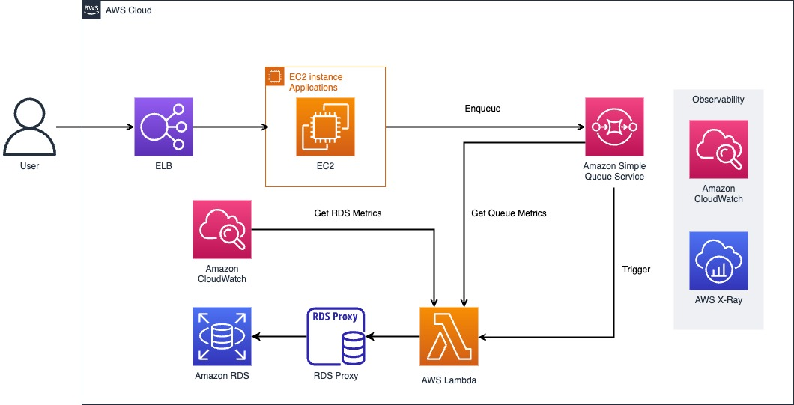

# Asynchronously writing to a database with Amazon SQS

This demo helps handle write loads asynchronously and maintain existing databases with AWS SQS and Lambda.
You'll be able to see and apply ways to handle intensive database write loads using the queue through this demo.

This demo is based on the `ap-northeast-2`. (Seoul region)

## Demo Architecture



## Quick Start

### Pre-Requisites
- GitHub Username and GitHub Token
- AWS Access Key and Secret Key with permissions
- Node.js environment at your local machine
- CDK-CLI at your local machine
  - Reference : https://docs.aws.amazon.com/cdk/v2/guide/getting_started.html
- Load testing tools such as JMeter

### How to start
#### 1. Fork this repository to your GitHub account

#### 2. Clone forked repository at your local machine

#### 3. Run this commands at root directory and insert information at .env
```shell
$ cp ./lib/.env-samples ./lib/.env
$ vim .env
```

#### 4. Create RDS service-linked Role.

1. IAM Roles > Create Role
2. Select **"AWS service"** at "Trusted entity type"
3. Select **"RDS"** at "Use case" and select the item with **"RDS"** among the radio buttons.
4. Click "Next", click "Next" again and click "Create Role"

#### 5. Run this commands at root directory for deploying infrastructure at AWS
```shell
# At root directory
$ npm i

$ cd ./lambda/rds-handler && npm i

$ cd .. && cd ..

$ npm run build

$ cdk bootstrap

$ cdk deploy

### Check
# If you don't have aws credential, you can fail deploying with cdk-cli
# you should set aws credential at your local machine.
# Please refer this link. (https://docs.aws.amazon.com/cdk/v2/guide/getting_started.html)
```

***Caution***
“Sleep 15m” is executed on the instance for a stable connection between the Demo Application and RDS Proxy.

Therefore, the demo application may not be booted properly; in this case, it is recommended to connect to the instance and run the Demo Applicaiton, or modify the "Launch Template" and refresh the instance after a certain period of time after the RDS Proxy opens.

Please wait about 5 minutes even if the creation with the cdk is complete 🥹

#### 5. If the step 4 is completed, Enjoy test with any load testing tool such as JMeter!

The example test schedule with JMeter is at statics/tester.

## Useful commands

* `npm run build`   compile typescript to js
* `npm run watch`   watch for changes and compile
* `npm run test`    perform the jest unit tests
* `cdk deploy`      deploy this stack to your default AWS account/region
* `cdk diff`        compare deployed stack with current state
* `cdk synth`       emits the synthesized CloudFormation template

## Security
See [CONTRIBUTING](/CONTRIBUTING.md#security-issue-notifications) for more information.

## License
This library is licensed under the MIT-0 License. See the [LICENSE](/LICENSE) file.